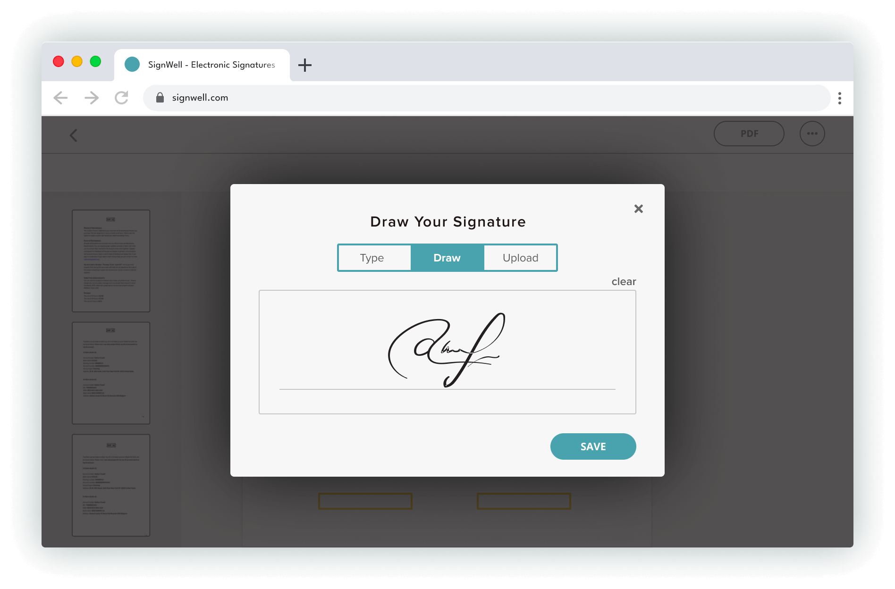

<div align="left">

[](https://signwell.com)

# [Signwell](https://signwell.com)<a id="signwell"></a>

When I started SignWell in 2019, I saw there was a need for an alternative to the hard-to-use and expensive e-signature software already out there. Documents can be complicated enough, but getting a document signed shouldn't be complicated too.

At SignWell, we pride ourselves not only on the ease and affordability of our e-signature process but also on our personalized and industry-leading customer support — whether it's for individual use or larger team accounts, SignWell is here to help you feel comfortable and confident getting your documents signed.

The SignWell mission? Simplify how documents get signed for millions of people and businesses. We're excited to help you continue to move toward the future of paperless document signing.

Ruben Gamez
Founder, SignWell

</div>

## Table of Contents<a id="table-of-contents"></a>

<!-- toc -->

- [Installation](#installation)
- [Getting Started](#getting-started)
- [Reference](#reference)
  * [`signwell.apiApplication.deleteById`](#signwellapiapplicationdeletebyid)
  * [`signwell.apiApplication.getDetails`](#signwellapiapplicationgetdetails)
  * [`signwell.bulkSend.createValidationCsv`](#signwellbulksendcreatevalidationcsv)
  * [`signwell.bulkSend.getCsvTemplate`](#signwellbulksendgetcsvtemplate)
  * [`signwell.bulkSend.getDocuments`](#signwellbulksendgetdocuments)
  * [`signwell.bulkSend.getInformation`](#signwellbulksendgetinformation)
  * [`signwell.bulkSend.listBulkSendings`](#signwellbulksendlistbulksendings)
  * [`signwell.bulkSend.validateCsv`](#signwellbulksendvalidatecsv)
  * [`signwell.document.createFromTemplate`](#signwelldocumentcreatefromtemplate)
  * [`signwell.document.createNewDocument`](#signwelldocumentcreatenewdocument)
  * [`signwell.document.deleteDocument`](#signwelldocumentdeletedocument)
  * [`signwell.document.getCompletedPdf`](#signwelldocumentgetcompletedpdf)
  * [`signwell.document.getDocumentData`](#signwelldocumentgetdocumentdata)
  * [`signwell.document.sendReminder`](#signwelldocumentsendreminder)
  * [`signwell.document.updateAndSend`](#signwelldocumentupdateandsend)
  * [`signwell.me.getAccountInfo`](#signwellmegetaccountinfo)
  * [`signwell.template.createNew`](#signwelltemplatecreatenew)
  * [`signwell.template.deleteDocumentTemplate`](#signwelltemplatedeletedocumenttemplate)
  * [`signwell.template.getTemplateData`](#signwelltemplategettemplatedata)
  * [`signwell.template.updateExistingTemplate`](#signwelltemplateupdateexistingtemplate)
  * [`signwell.webhooks.deleteCallbackUrl`](#signwellwebhooksdeletecallbackurl)
  * [`signwell.webhooks.getAll`](#signwellwebhooksgetall)
  * [`signwell.webhooks.registerCallbackUrl`](#signwellwebhooksregistercallbackurl)

<!-- tocstop -->

## Installation<a id="installation"></a>
<div align="center">
  <a href="https://konfigthis.com/sdk-sign-up?company=SignWell&language=TypeScript">
    
  </a>
</div>

## Getting Started<a id="getting-started"></a>

```typescript
import { SignWell } from "sign-well-typescript-sdk";

const signwell = new SignWell({
  // Defining the base path is optional and defaults to https://www.signwell.com
  // basePath: "https://www.signwell.com",
  apiKey: "API_KEY",
});

const deleteByIdResponse = await signwell.apiApplication.deleteById({
  id: "id_example",
});

console.log(deleteByIdResponse);
```

## Reference<a id="reference"></a>


### `signwell.apiApplication.deleteById`<a id="signwellapiapplicationdeletebyid"></a>

Deletes an API Application from an account. Supply the unique Application ID from either the Create API Application response or the API Application edit page

#### 🛠️ Usage<a id="🛠️-usage"></a>

```typescript
const deleteByIdResponse = await signwell.apiApplication.deleteById({
  id: "id_example",
});
```

#### ⚙️ Parameters<a id="⚙️-parameters"></a>

##### id: `string`<a id="id-string"></a>

#### 🌐 Endpoint<a id="🌐-endpoint"></a>

`/api/v1/api_applications/{id}` `DELETE`

[🔙 **Back to Table of Contents**](#table-of-contents)

---


### `signwell.apiApplication.getDetails`<a id="signwellapiapplicationgetdetails"></a>

Gets the details of a specific API Application within an account. Supply the unique Application ID from either the Create API Application response or the API Application edit page.

#### 🛠️ Usage<a id="🛠️-usage"></a>

```typescript
const getDetailsResponse = await signwell.apiApplication.getDetails({
  id: "id_example",
});
```

#### ⚙️ Parameters<a id="⚙️-parameters"></a>

##### id: `string`<a id="id-string"></a>

#### 🔄 Return<a id="🔄-return"></a>

[ApiApplicationGetDetailsResponse](./models/api-application-get-details-response.ts)

#### 🌐 Endpoint<a id="🌐-endpoint"></a>

`/api/v1/api_applications/{id}` `GET`

[🔙 **Back to Table of Contents**](#table-of-contents)

---


### `signwell.bulkSend.createValidationCsv`<a id="signwellbulksendcreatevalidationcsv"></a>

Creates a bulk send, and it validates the CSV file before creating the bulk send.

#### 🛠️ Usage<a id="🛠️-usage"></a>

```typescript
const createValidationCsvResponse = await signwell.bulkSend.createValidationCsv(
  {
    template_ids: ["template_ids_example"],
    bulk_send_csv: "YQ==",
    skip_row_errors: false,
    apply_signing_order: false,
  }
);
```

#### ⚙️ Parameters<a id="⚙️-parameters"></a>

##### template_ids: `string`[]<a id="template_ids-string"></a>

Unique identifiers for a list of templates.

##### bulk_send_csv: `string`<a id="bulk_send_csv-string"></a>

A RFC 4648 base64 string of the template CSV file to be validated.

##### skip_row_errors: `boolean`<a id="skip_row_errors-boolean"></a>

Whether to skip errors in the rows. Defaults to `false`.

##### api_application_id: `string`<a id="api_application_id-string"></a>

Unique identifier for API Application settings to use. API Applications are optional and mainly used when isolating OAuth apps or for more control over embedded API settings

##### name: `string`<a id="name-string"></a>

The name of the Bulk Send. Will be used as the document name for each of the documents.

##### subject: `string`<a id="subject-string"></a>

Email subject for the signature request that recipients will see. Defaults to the default system subject or a template subject.

##### message: `string`<a id="message-string"></a>

Email message for the signature request that recipients will see. Defaults to the default system message or a template message.

##### apply_signing_order: `boolean`<a id="apply_signing_order-boolean"></a>

When set to `true` recipients will sign one at a time in the order of the `recipients` collection of this request.

##### custom_requester_name: `string`<a id="custom_requester_name-string"></a>

Sets the custom requester name for the document. When set, this is the name used for all email communications, signing notifications, and in the audit file.

##### custom_requester_email: `string`<a id="custom_requester_email-string"></a>

Sets the custom requester email for the document. When set, this is the email used for all email communications, signing notifications, and in the audit file.

#### 🔄 Return<a id="🔄-return"></a>

[BulkSendCreateValidationCsvResponse](./models/bulk-send-create-validation-csv-response.ts)

#### 🌐 Endpoint<a id="🌐-endpoint"></a>

`/api/v1/bulk_sends` `POST`

[🔙 **Back to Table of Contents**](#table-of-contents)

---


### `signwell.bulkSend.getCsvTemplate`<a id="signwellbulksendgetcsvtemplate"></a>

Fetches a CSV template that corresponds to the provided document template IDs. CSV templates are blank CSV files that have columns containing required and optional data that can be sent when creating a bulk send. Fields can be referenced by the field label. Example: [placeholder name]_[field label] could be something like customer_address or signer_company_name (if "Customer" and "Signer" were placeholder names for templates set up in SignWell).

#### 🛠️ Usage<a id="🛠️-usage"></a>

```typescript
const getCsvTemplateResponse = await signwell.bulkSend.getCsvTemplate({
  templateIds: ["templateIds_example"],
});
```

#### ⚙️ Parameters<a id="⚙️-parameters"></a>

##### templateIds: `string`[]<a id="templateids-string"></a>

##### base64: `string`<a id="base64-string"></a>

#### 🔄 Return<a id="🔄-return"></a>

[BulkSendGetCsvTemplate200Response](./models/bulk-send-get-csv-template200-response.ts)

#### 🌐 Endpoint<a id="🌐-endpoint"></a>

`/api/v1/bulk_sends/csv_template` `GET`

[🔙 **Back to Table of Contents**](#table-of-contents)

---


### `signwell.bulkSend.getDocuments`<a id="signwellbulksendgetdocuments"></a>

Returns information about the Bulk Send.

#### 🛠️ Usage<a id="🛠️-usage"></a>

```typescript
const getDocumentsResponse = await signwell.bulkSend.getDocuments({
  id: "id_example",
  limit: 10,
  page: 1,
});
```

#### ⚙️ Parameters<a id="⚙️-parameters"></a>

##### id: `string`<a id="id-string"></a>

##### limit: `number`<a id="limit-number"></a>

##### page: `number`<a id="page-number"></a>

#### 🔄 Return<a id="🔄-return"></a>

[BulkSendGetDocumentsResponse](./models/bulk-send-get-documents-response.ts)

#### 🌐 Endpoint<a id="🌐-endpoint"></a>

`/api/v1/bulk_sends/{id}/documents` `GET`

[🔙 **Back to Table of Contents**](#table-of-contents)

---


### `signwell.bulkSend.getInformation`<a id="signwellbulksendgetinformation"></a>

Returns information about the Bulk Send.

#### 🛠️ Usage<a id="🛠️-usage"></a>

```typescript
const getInformationResponse = await signwell.bulkSend.getInformation({
  id: "id_example",
});
```

#### ⚙️ Parameters<a id="⚙️-parameters"></a>

##### id: `string`<a id="id-string"></a>

#### 🔄 Return<a id="🔄-return"></a>

[BulkSendGetInformationResponse](./models/bulk-send-get-information-response.ts)

#### 🌐 Endpoint<a id="🌐-endpoint"></a>

`/api/v1/bulk_sends/{id}` `GET`

[🔙 **Back to Table of Contents**](#table-of-contents)

---


### `signwell.bulkSend.listBulkSendings`<a id="signwellbulksendlistbulksendings"></a>

Returns information about the Bulk Send.

#### 🛠️ Usage<a id="🛠️-usage"></a>

```typescript
const listBulkSendingsResponse = await signwell.bulkSend.listBulkSendings({
  limit: 10,
  page: 1,
});
```

#### ⚙️ Parameters<a id="⚙️-parameters"></a>

##### userEmail: `string`<a id="useremail-string"></a>

##### limit: `number`<a id="limit-number"></a>

##### page: `number`<a id="page-number"></a>

##### apiApplicationId: `string`<a id="apiapplicationid-string"></a>

#### 🔄 Return<a id="🔄-return"></a>

[BulkSendListBulkSendingsResponse](./models/bulk-send-list-bulk-sendings-response.ts)

#### 🌐 Endpoint<a id="🌐-endpoint"></a>

`/api/v1/bulk_sends` `GET`

[🔙 **Back to Table of Contents**](#table-of-contents)

---


### `signwell.bulkSend.validateCsv`<a id="signwellbulksendvalidatecsv"></a>

Validates a Bulk Send CSV file before creating the Bulk Send. It will check the structure of the CSV and the data it contains, and return any errors found.

#### 🛠️ Usage<a id="🛠️-usage"></a>

```typescript
const validateCsvResponse = await signwell.bulkSend.validateCsv({
  template_ids: ["template_ids_example"],
  bulk_send_csv: "YQ==",
});
```

#### ⚙️ Parameters<a id="⚙️-parameters"></a>

##### template_ids: `string`[]<a id="template_ids-string"></a>

Specify one or more templates to generate a single blank CSV file that will contain available columns for your recipient data. The template_ids[] parameter is an array of template IDs (e.g.,`/?template_ids[]=5a67dbd7-928a-4ea0-a7e2-e476a0eb045f&template_ids[]=d7315111-c671-4b15-8354-c9a19bbaefa0`). Each ID should be a separate parameter in the query string.

##### bulk_send_csv: `string`<a id="bulk_send_csv-string"></a>

A RFC 4648 base64 string of the template CSV file to be validated.

#### 🔄 Return<a id="🔄-return"></a>

[BulkSendValidateCsvResponse](./models/bulk-send-validate-csv-response.ts)

#### 🌐 Endpoint<a id="🌐-endpoint"></a>

`/api/v1/bulk_sends/validate_csv` `POST`

[🔙 **Back to Table of Contents**](#table-of-contents)

---


### `signwell.document.createFromTemplate`<a id="signwelldocumentcreatefromtemplate"></a>

Creates and optionally sends a new document for signing. If `draft` is set to false the document will not be sent.

#### 🛠️ Usage<a id="🛠️-usage"></a>

```typescript
const createFromTemplateResponse = await signwell.document.createFromTemplate({
  test_mode: false,
  recipients: [
    {
      id: "id_example",
      email: "email_example",
      send_email: false,
      send_email_delay: 0,
    },
  ],
  draft: false,
  with_signature_page: false,
  reminders: true,
  apply_signing_order: false,
  embedded_signing: false,
  embedded_signing_notifications: false,
  text_tags: false,
  allow_decline: true,
  allow_reassign: true,
});
```

#### ⚙️ Parameters<a id="⚙️-parameters"></a>

##### recipients: [`TemplateRecipientsMapInner`](./models/template-recipients-map-inner.ts)[]<a id="recipients-templaterecipientsmapinnermodelstemplate-recipients-map-innerts"></a>

Document recipients are people that must complete and/or sign a document. Recipients of the document must be assigned to a placeholder of the template. Recipients will inherit all placeholder fields and settings.

##### test_mode: `boolean`<a id="test_mode-boolean"></a>

Set to `true` to enable Test Mode. Documents created with Test Mode do not count towards API billing and are not legally binding. Defaults to `false`

##### template_id: `string`<a id="template_id-string"></a>

Use when you have to create a document from a single template. Either :template_id or :template_ids must be present in the request, not both.

##### template_ids: `string`[]<a id="template_ids-string"></a>

Use when you have to create a document from multiple templates. Either :template_id or :template_ids must be present in the request, not both.

##### name: `string`<a id="name-string"></a>

The name of the document.

##### subject: `string`<a id="subject-string"></a>

Email subject for the signature request that recipients will see. Defaults to the default system subject or a template subject (if the document is created from a template).

##### message: `string`<a id="message-string"></a>

Email message for the signature request that recipients will see. Defaults to the default system message or a template message (if the document is created from a template).

##### draft: `boolean`<a id="draft-boolean"></a>

Whether the document can still be updated before sending a signature request. If set to `false` the document is sent for signing as part of this request. Defaults to `false`.

##### with_signature_page: `boolean`<a id="with_signature_page-boolean"></a>

When set to `true` the document will have a signature page added to the end, and all signers will be required to add their signature on that page.

##### expires_in: `number`<a id="expires_in-number"></a>

Number of days before the signature request expires. Defaults to the account expiration setting or template expiration (if the document is created from a template).

##### reminders: `boolean`<a id="reminders-boolean"></a>

Whether to send signing reminders to recipients. Reminders are sent on day 3, day 6, and day 10 if set to `true`. Defaults to `true`.

##### apply_signing_order: `boolean`<a id="apply_signing_order-boolean"></a>

When set to `true` recipients will sign one at a time in the order of the `recipients` collection of this request.

##### api_application_id: `string`<a id="api_application_id-string"></a>

Unique identifier for API Application settings to use. API Applications are optional and mainly used when isolating OAuth apps or for more control over embedded API settings

##### embedded_signing: `boolean`<a id="embedded_signing-boolean"></a>

When set to `true` it enables embedded signing in your website/web application. Embedded functionality works with an iFrame and email authentication is disabled. :embedded_signinig defaults to `false`.

##### embedded_signing_notifications: `boolean`<a id="embedded_signing_notifications-boolean"></a>

On embedding signing, document owners (and CC\\\'d contacts) do not get a notification email when documents have been completed. Setting this param to `true` will send out those final completed notifications. Default is `false`

##### text_tags: `boolean`<a id="text_tags-boolean"></a>

An alternative way (if you can’t use the recommended way) of placing fields in specific locations of your document by using special text tags. Useful when changing the content of your files changes the location of fields. See API documentation for “Text Tags” for details. Defaults to false.

##### custom_requester_name: `string`<a id="custom_requester_name-string"></a>

Sets the custom requester name for the document. When set, this is the name used for all email communications, signing notifications, and in the audit file.

##### custom_requester_email: `string`<a id="custom_requester_email-string"></a>

Sets the custom requester email for the document. When set, this is the email used for all email communications, signing notifications, and in the audit file.

##### redirect_url: `string`<a id="redirect_url-string"></a>

A URL that recipients are redirected to after successfully signing a document.

##### allow_decline: `boolean`<a id="allow_decline-boolean"></a>

Whether to allow recipients the option to decline signing a document. If multiple signers are involved in a document, any single recipient can cancel the entire document signing process by declining to sign.

##### allow_reassign: `boolean`<a id="allow_reassign-boolean"></a>

In some cases a signer is not the right person to sign and may need to reassign their signing responsibilities to another person. This feature allows them to reassign the document to someone else.

##### decline_redirect_url: `string`<a id="decline_redirect_url-string"></a>

A URL that recipients are redirected to if the document is declined.

##### metadata: `object`<a id="metadata-object"></a>

Optional key-value data that can be associated with the document. If set, will be available every time the document data is returned.

##### template_fields: [`TemplateFieldsMapInner`](./models/template-fields-map-inner.ts)[]<a id="template_fields-templatefieldsmapinnermodelstemplate-fields-map-innerts"></a>

Fields of your template(s) that you can prepopulate with values. Signature and Initials fields cannot be signed through the API.

##### files: [`AdditionalFilesMapInner`](./models/additional-files-map-inner.ts)[]<a id="files-additionalfilesmapinnermodelsadditional-files-map-innerts"></a>

##### fields: [`AdditionalFieldsMapInnerInner`](./models/additional-fields-map-inner-inner.ts)[][]<a id="fields-additionalfieldsmapinnerinnermodelsadditional-fields-map-inner-innerts"></a>

Fields to be added to any appended files (not existing files). Document fields placed on a document for collecting data or signatures from recipients. Field data should be sent as a 2-dimensional JSON array. One array of fields is needed for each file in the files array. An array of fields can be empty if you have a file that does not contain any fields.

##### attachment_requests: [`AttachmentRequestsMapInner`](./models/attachment-requests-map-inner.ts)[]<a id="attachment_requests-attachmentrequestsmapinnermodelsattachment-requests-map-innerts"></a>

Attachments that a recipient must upload to complete the signing process. Attachment requests are shown after all document fields have been completed.

##### copied_contacts: [`CopiedContactsMapInner`](./models/copied-contacts-map-inner.ts)[]<a id="copied_contacts-copiedcontactsmapinnermodelscopied-contacts-map-innerts"></a>

Copied contacts are emailed the final document once it has been completed by all recipients.

#### 🔄 Return<a id="🔄-return"></a>

[DocumentCreateFromTemplateResponse](./models/document-create-from-template-response.ts)

#### 🌐 Endpoint<a id="🌐-endpoint"></a>

`/api/v1/document_templates/documents` `POST`

[🔙 **Back to Table of Contents**](#table-of-contents)

---


### `signwell.document.createNewDocument`<a id="signwelldocumentcreatenewdocument"></a>

Creates and optionally sends a new document for signing. If `draft` is set to false the document will not be sent.

#### 🛠️ Usage<a id="🛠️-usage"></a>

```typescript
const createNewDocumentResponse = await signwell.document.createNewDocument({
  test_mode: false,
  files: [
    {
      name: "name_example",
    },
  ],
  recipients: [
    {
      id: "id_example",
      email: "email_example",
      send_email: false,
      send_email_delay: 0,
    },
  ],
  draft: false,
  with_signature_page: false,
  reminders: true,
  apply_signing_order: false,
  embedded_signing: false,
  embedded_signing_notifications: false,
  text_tags: false,
  allow_decline: true,
  allow_reassign: true,
});
```

#### ⚙️ Parameters<a id="⚙️-parameters"></a>

##### files: [`FilesMapInner`](./models/files-map-inner.ts)[]<a id="files-filesmapinnermodelsfiles-map-innerts"></a>

##### recipients: [`DocumentRecipientsMapInner`](./models/document-recipients-map-inner.ts)[]<a id="recipients-documentrecipientsmapinnermodelsdocument-recipients-map-innerts"></a>

Document recipients are people that must complete and/or sign a document.

##### test_mode: `boolean`<a id="test_mode-boolean"></a>

Set to `true` to enable Test Mode. Documents created with Test Mode do not count towards API billing and are not legally binding. Defaults to `false`

##### name: `string`<a id="name-string"></a>

The name of the document.

##### subject: `string`<a id="subject-string"></a>

Email subject for the signature request that recipients will see. Defaults to the default system subject or a template subject (if the document is created from a template).

##### message: `string`<a id="message-string"></a>

Email message for the signature request that recipients will see. Defaults to the default system message or a template message (if the document is created from a template).

##### draft: `boolean`<a id="draft-boolean"></a>

Whether the document can still be updated before sending a signature request. If set to `false` the document is sent for signing as part of this request. Defaults to `false`.

##### with_signature_page: `boolean`<a id="with_signature_page-boolean"></a>

When set to `true` the document will have a signature page added to the end, and all signers will be required to add their signature on that page.

##### expires_in: `number`<a id="expires_in-number"></a>

Number of days before the signature request expires. Defaults to the account expiration setting or template expiration (if the document is created from a template).

##### reminders: `boolean`<a id="reminders-boolean"></a>

Whether to send signing reminders to recipients. Reminders are sent on day 3, day 6, and day 10 if set to `true`. Defaults to `true`.

##### apply_signing_order: `boolean`<a id="apply_signing_order-boolean"></a>

When set to `true` recipients will sign one at a time in the order of the `recipients` collection of this request.

##### api_application_id: `string`<a id="api_application_id-string"></a>

Unique identifier for API Application settings to use. API Applications are optional and mainly used when isolating OAuth apps or for more control over embedded API settings

##### embedded_signing: `boolean`<a id="embedded_signing-boolean"></a>

When set to `true` it enables embedded signing in your website/web application. Embedded functionality works with an iFrame and email authentication is disabled. :embedded_signinig defaults to `false`.

##### embedded_signing_notifications: `boolean`<a id="embedded_signing_notifications-boolean"></a>

On embedding signing, document owners (and CC\\\'d contacts) do not get a notification email when documents have been completed. Setting this param to `true` will send out those final completed notifications. Default is `false`

##### text_tags: `boolean`<a id="text_tags-boolean"></a>

An alternative way (if you can’t use the recommended way) of placing fields in specific locations of your document by using special text tags. Useful when changing the content of your files changes the location of fields. See API documentation for “Text Tags” for details. Defaults to false.

##### custom_requester_name: `string`<a id="custom_requester_name-string"></a>

Sets the custom requester name for the document. When set, this is the name used for all email communications, signing notifications, and in the audit file.

##### custom_requester_email: `string`<a id="custom_requester_email-string"></a>

Sets the custom requester email for the document. When set, this is the email used for all email communications, signing notifications, and in the audit file.

##### redirect_url: `string`<a id="redirect_url-string"></a>

A URL that recipients are redirected to after successfully signing a document.

##### allow_decline: `boolean`<a id="allow_decline-boolean"></a>

Whether to allow recipients the option to decline signing a document. If multiple signers are involved in a document, any single recipient can cancel the entire document signing process by declining to sign.

##### allow_reassign: `boolean`<a id="allow_reassign-boolean"></a>

In some cases a signer is not the right person to sign and may need to reassign their signing responsibilities to another person. This feature allows them to reassign the document to someone else.

##### decline_redirect_url: `string`<a id="decline_redirect_url-string"></a>

A URL that recipients are redirected to if the document is declined.

##### metadata: `object`<a id="metadata-object"></a>

Optional key-value data that can be associated with the document. If set, will be available every time the document data is returned.

##### fields: [`FieldsMapInnerInner`](./models/fields-map-inner-inner.ts)[][]<a id="fields-fieldsmapinnerinnermodelsfields-map-inner-innerts"></a>

Document fields placed on a document for collecting data or signatures from recipients. At least one field must be present in the Create Document request if `draft` is `false` (unless adding a signature page by using `with_signature_page`). Field data should be sent as a 2-dimensional JSON array. One array of fields is needed for each file in the files array. An array of fields can be empty if you have a file that does not contain any fields.

##### attachment_requests: [`AttachmentRequestsMapInner`](./models/attachment-requests-map-inner.ts)[]<a id="attachment_requests-attachmentrequestsmapinnermodelsattachment-requests-map-innerts"></a>

Attachments that a recipient must upload to complete the signing process. Attachment requests are shown after all document fields have been completed.

##### copied_contacts: [`CopiedContactsMapInner`](./models/copied-contacts-map-inner.ts)[]<a id="copied_contacts-copiedcontactsmapinnermodelscopied-contacts-map-innerts"></a>

Copied contacts are emailed the final document once it has been completed by all recipients.

#### 🔄 Return<a id="🔄-return"></a>

[DocumentCreateNewDocumentResponse](./models/document-create-new-document-response.ts)

#### 🌐 Endpoint<a id="🌐-endpoint"></a>

`/api/v1/documents` `POST`

[🔙 **Back to Table of Contents**](#table-of-contents)

---


### `signwell.document.deleteDocument`<a id="signwelldocumentdeletedocument"></a>

Deletes a document. Deleting a document will also cancel document signing (if in progress).  Supply the unique document ID from either a Create Document request or document page URL.

#### 🛠️ Usage<a id="🛠️-usage"></a>

```typescript
const deleteDocumentResponse = await signwell.document.deleteDocument({
  id: "id_example",
});
```

#### ⚙️ Parameters<a id="⚙️-parameters"></a>

##### id: `string`<a id="id-string"></a>

#### 🌐 Endpoint<a id="🌐-endpoint"></a>

`/api/v1/documents/{id}` `DELETE`

[🔙 **Back to Table of Contents**](#table-of-contents)

---


### `signwell.document.getCompletedPdf`<a id="signwelldocumentgetcompletedpdf"></a>

Gets a completed document PDF. Supply the unique document ID from either a document creation request or document page URL.

#### 🛠️ Usage<a id="🛠️-usage"></a>

```typescript
const getCompletedPdfResponse = await signwell.document.getCompletedPdf({
  id: "id_example",
  urlOnly: false,
  auditPage: true,
});
```

#### ⚙️ Parameters<a id="⚙️-parameters"></a>

##### id: `string`<a id="id-string"></a>

##### urlOnly: `boolean`<a id="urlonly-boolean"></a>

##### auditPage: `boolean`<a id="auditpage-boolean"></a>

#### 🔄 Return<a id="🔄-return"></a>

[DocumentGetCompletedPdfResponse](./models/document-get-completed-pdf-response.ts)

#### 🌐 Endpoint<a id="🌐-endpoint"></a>

`/api/v1/documents/{id}/completed_pdf` `GET`

[🔙 **Back to Table of Contents**](#table-of-contents)

---


### `signwell.document.getDocumentData`<a id="signwelldocumentgetdocumentdata"></a>

Returns a document and all associated document data. Supply the unique document ID from either a document creation request or Document page URL.

#### 🛠️ Usage<a id="🛠️-usage"></a>

```typescript
const getDocumentDataResponse = await signwell.document.getDocumentData({
  id: "id_example",
});
```

#### ⚙️ Parameters<a id="⚙️-parameters"></a>

##### id: `string`<a id="id-string"></a>

#### 🔄 Return<a id="🔄-return"></a>

[DocumentGetDocumentDataResponse](./models/document-get-document-data-response.ts)

#### 🌐 Endpoint<a id="🌐-endpoint"></a>

`/api/v1/documents/{id}` `GET`

[🔙 **Back to Table of Contents**](#table-of-contents)

---


### `signwell.document.sendReminder`<a id="signwelldocumentsendreminder"></a>

Sends a reminder email to recipients that have not signed yet.

#### 🛠️ Usage<a id="🛠️-usage"></a>

```typescript
const sendReminderResponse = await signwell.document.sendReminder({
  id: "id_example",
});
```

#### ⚙️ Parameters<a id="⚙️-parameters"></a>

##### id: `string`<a id="id-string"></a>

##### recipients: [`RemindRecipientsMapInner`](./models/remind-recipients-map-inner.ts)[]<a id="recipients-remindrecipientsmapinnermodelsremind-recipients-map-innerts"></a>

Optional list if recipients within the document to send a reminder email to. If none are specified, all recipients that have not signed yet will receive a reminder email.

#### 🔄 Return<a id="🔄-return"></a>

[DocumentSendReminderResponse](./models/document-send-reminder-response.ts)

#### 🌐 Endpoint<a id="🌐-endpoint"></a>

`/api/v1/documents/{id}/remind` `POST`

[🔙 **Back to Table of Contents**](#table-of-contents)

---


### `signwell.document.updateAndSend`<a id="signwelldocumentupdateandsend"></a>

Updates a draft document and sends it to be signed by recipients.

#### 🛠️ Usage<a id="🛠️-usage"></a>

```typescript
const updateAndSendResponse = await signwell.document.updateAndSend({
  id: "id_example",
  test_mode: false,
  reminders: true,
  apply_signing_order: false,
  embedded_signing: false,
  embedded_signing_notifications: false,
  allow_decline: true,
  allow_reassign: true,
});
```

#### ⚙️ Parameters<a id="⚙️-parameters"></a>

##### id: `string`<a id="id-string"></a>

##### test_mode: `boolean`<a id="test_mode-boolean"></a>

Set to `true` to enable Test Mode. Documents created with Test Mode do not count towards API billing and are not legally binding. Defaults to `false`

##### name: `string`<a id="name-string"></a>

The name of the document.

##### subject: `string`<a id="subject-string"></a>

Email subject for the signature request that recipients will see. Defaults to the default system subject or a template subject (if the document is created from a template).

##### message: `string`<a id="message-string"></a>

Email message for the signature request that recipients will see. Defaults to the default system message or a template message (if the document is created from a template).

##### expires_in: `number`<a id="expires_in-number"></a>

Number of days before the signature request expires. Defaults to the account expiration setting or template expiration (if the document is created from a template).

##### reminders: `boolean`<a id="reminders-boolean"></a>

Whether to send signing reminders to recipients. Reminders are sent on day 3, day 6, and day 10 if set to `true`. Defaults to `true`.

##### apply_signing_order: `boolean`<a id="apply_signing_order-boolean"></a>

When set to `true` recipients will sign one at a time in the order of the `recipients` collection of this request.

##### api_application_id: `string`<a id="api_application_id-string"></a>

Unique identifier for API Application settings to use. API Applications are optional and mainly used when isolating OAuth apps or for more control over embedded API settings

##### embedded_signing: `boolean`<a id="embedded_signing-boolean"></a>

When set to `true` it enables embedded signing in your website/web application. Embedded functionality works with an iFrame and email authentication is disabled. :embedded_signinig defaults to `false`.

##### embedded_signing_notifications: `boolean`<a id="embedded_signing_notifications-boolean"></a>

On embedding signing, document owners (and CC\\\'d contacts) do not get a notification email when documents have been completed. Setting this param to `true` will send out those final completed notifications. Default is `false`

##### custom_requester_name: `string`<a id="custom_requester_name-string"></a>

Sets the custom requester name for the document. When set, this is the name used for all email communications, signing notifications, and in the audit file.

##### custom_requester_email: `string`<a id="custom_requester_email-string"></a>

Sets the custom requester email for the document. When set, this is the email used for all email communications, signing notifications, and in the audit file.

##### redirect_url: `string`<a id="redirect_url-string"></a>

A URL that recipients are redirected to after successfully signing a document.

##### allow_decline: `boolean`<a id="allow_decline-boolean"></a>

Whether to allow recipients the option to decline signing a document. If multiple signers are involved in a document, any single recipient can cancel the entire document signing process by declining to sign.

##### allow_reassign: `boolean`<a id="allow_reassign-boolean"></a>

In some cases a signer is not the right person to sign and may need to reassign their signing responsibilities to another person. This feature allows them to reassign the document to someone else.

##### decline_redirect_url: `string`<a id="decline_redirect_url-string"></a>

A URL that recipients are redirected to if the document is declined.

##### metadata: `object`<a id="metadata-object"></a>

Optional key-value data that can be associated with the document. If set, will be available every time the document data is returned.

#### 🔄 Return<a id="🔄-return"></a>

[DocumentUpdateAndSendResponse](./models/document-update-and-send-response.ts)

#### 🌐 Endpoint<a id="🌐-endpoint"></a>

`/api/v1/documents/{id}/send` `POST`

[🔙 **Back to Table of Contents**](#table-of-contents)

---


### `signwell.me.getAccountInfo`<a id="signwellmegetaccountinfo"></a>

Retrieves the account information associated with the API key being used.

#### 🛠️ Usage<a id="🛠️-usage"></a>

```typescript
const getAccountInfoResponse = await signwell.me.getAccountInfo();
```

#### 🔄 Return<a id="🔄-return"></a>

[MeGetAccountInfoResponse](./models/me-get-account-info-response.ts)

#### 🌐 Endpoint<a id="🌐-endpoint"></a>

`/api/v1/me` `GET`

[🔙 **Back to Table of Contents**](#table-of-contents)

---


### `signwell.template.createNew`<a id="signwelltemplatecreatenew"></a>

Creates a new template.

#### 🛠️ Usage<a id="🛠️-usage"></a>

```typescript
const createNewResponse = await signwell.template.createNew({
  files: [
    {
      name: "name_example",
    },
  ],
  placeholders: [
    {
      id: "id_example",
      name: "name_example",
    },
  ],
  draft: false,
  reminders: true,
  apply_signing_order: false,
  text_tags: false,
  allow_decline: true,
  allow_reassign: true,
});
```

#### ⚙️ Parameters<a id="⚙️-parameters"></a>

##### files: [`FilesMapInner`](./models/files-map-inner.ts)[]<a id="files-filesmapinnermodelsfiles-map-innerts"></a>

##### placeholders: [`PlaceholdersMapInner`](./models/placeholders-map-inner.ts)[]<a id="placeholders-placeholdersmapinnermodelsplaceholders-map-innerts"></a>

Placeholders are generally job roles that must complete and/or sign the document. For example, a placeholder might be “Client” or “Legal Department”. When a document is created from the template, you assign a person to each placeholder.

##### name: `string`<a id="name-string"></a>

The name of the template.

##### subject: `string`<a id="subject-string"></a>

Email subject for the signature request that recipients will see. Defaults to the default system subject or a template subject (if the document is created from a template).

##### message: `string`<a id="message-string"></a>

Email message for the signature request that recipients will see. Defaults to the default system message or a template message (if the document is created from a template).

##### copied_placeholders: [`CopiedPlaceholdersMapInner`](./models/copied-placeholders-map-inner.ts)[]<a id="copied_placeholders-copiedplaceholdersmapinnermodelscopied-placeholders-map-innerts"></a>

Copied placeholders are emailed the final document once it has been completed by all recipients.

##### draft: `boolean`<a id="draft-boolean"></a>

Whether the template can still be updated before it is ready for usage. If set to `false` the template is marked as `Available` and it will be ready for use. Defaults to `false`.

##### expires_in: `number`<a id="expires_in-number"></a>

Number of days before the signature request expires. Defaults to the account expiration setting or template expiration (if the document is created from a template).

##### reminders: `boolean`<a id="reminders-boolean"></a>

Whether to send signing reminders to recipients. Reminders are sent on day 3, day 6, and day 10 if set to `true`. Defaults to `true`.

##### apply_signing_order: `boolean`<a id="apply_signing_order-boolean"></a>

When set to `true` recipients will sign one at a time in the order of the `recipients` collection of this request.

##### api_application_id: `string`<a id="api_application_id-string"></a>

Unique identifier for API Application settings to use. API Applications are optional and mainly used when isolating OAuth apps or for more control over embedded API settings

##### text_tags: `boolean`<a id="text_tags-boolean"></a>

An alternative way (if you can’t use the recommended way) of placing fields in specific locations of your document by using special text tags. Useful when changing the content of your files changes the location of fields. See API documentation for “Text Tags” for details. Defaults to false.

##### redirect_url: `string`<a id="redirect_url-string"></a>

A URL that recipients are redirected to after successfully signing a document.

##### allow_decline: `boolean`<a id="allow_decline-boolean"></a>

Whether to allow recipients the option to decline signing a document. If multiple signers are involved in a document, any single recipient can cancel the entire document signing process by declining to sign.

##### allow_reassign: `boolean`<a id="allow_reassign-boolean"></a>

In some cases a signer is not the right person to sign and may need to reassign their signing responsibilities to another person. This feature allows them to reassign the document to someone else.

##### decline_redirect_url: `string`<a id="decline_redirect_url-string"></a>

A URL that recipients are redirected to if the document is declined.

##### metadata: `object`<a id="metadata-object"></a>

Optional key-value data that can be associated with the document. If set, will be available every time the document data is returned.

##### fields: [`FieldsForTemplateMapInnerInner`](./models/fields-for-template-map-inner-inner.ts)[][]<a id="fields-fieldsfortemplatemapinnerinnermodelsfields-for-template-map-inner-innerts"></a>

Document fields placed on a document for collecting data or signatures from recipients. At least one field must be present in the Create Document request if `draft` is `false` (unless adding a signature page by using `with_signature_page`). Field data should be sent as a 2-dimensional JSON array. One array of fields is needed for each file in the files array. An array of fields can be empty if you have a file that does not contain any fields.

##### attachment_requests: [`AttachmentRequestsForTemplateMapInner`](./models/attachment-requests-for-template-map-inner.ts)[]<a id="attachment_requests-attachmentrequestsfortemplatemapinnermodelsattachment-requests-for-template-map-innerts"></a>

Attachments that a recipient must upload to complete the signing process. Attachment requests are shown after all document fields have been completed.

#### 🔄 Return<a id="🔄-return"></a>

[TemplateCreateNewResponse](./models/template-create-new-response.ts)

#### 🌐 Endpoint<a id="🌐-endpoint"></a>

`/api/v1/document_templates` `POST`

[🔙 **Back to Table of Contents**](#table-of-contents)

---


### `signwell.template.deleteDocumentTemplate`<a id="signwelltemplatedeletedocumenttemplate"></a>

Deletes a template. Supply the unique template ID from either a Create Template request or template page URL.

#### 🛠️ Usage<a id="🛠️-usage"></a>

```typescript
const deleteDocumentTemplateResponse =
  await signwell.template.deleteDocumentTemplate({
    id: "id_example",
  });
```

#### ⚙️ Parameters<a id="⚙️-parameters"></a>

##### id: `string`<a id="id-string"></a>

#### 🌐 Endpoint<a id="🌐-endpoint"></a>

`/api/v1/document_templates/{id}` `DELETE`

[🔙 **Back to Table of Contents**](#table-of-contents)

---


### `signwell.template.getTemplateData`<a id="signwelltemplategettemplatedata"></a>

Returns a template and all associated template data. Supply the unique template ID from either a Create Template request or template page URL.

#### 🛠️ Usage<a id="🛠️-usage"></a>

```typescript
const getTemplateDataResponse = await signwell.template.getTemplateData({
  id: "id_example",
});
```

#### ⚙️ Parameters<a id="⚙️-parameters"></a>

##### id: `string`<a id="id-string"></a>

#### 🔄 Return<a id="🔄-return"></a>

[TemplateGetTemplateDataResponse](./models/template-get-template-data-response.ts)

#### 🌐 Endpoint<a id="🌐-endpoint"></a>

`/api/v1/document_templates/{id}` `GET`

[🔙 **Back to Table of Contents**](#table-of-contents)

---


### `signwell.template.updateExistingTemplate`<a id="signwelltemplateupdateexistingtemplate"></a>

Updates an existing template.

#### 🛠️ Usage<a id="🛠️-usage"></a>

```typescript
const updateExistingTemplateResponse =
  await signwell.template.updateExistingTemplate({
    id: "id_example",
    draft: false,
    reminders: true,
    apply_signing_order: false,
    allow_decline: true,
    allow_reassign: true,
  });
```

#### ⚙️ Parameters<a id="⚙️-parameters"></a>

##### id: `string`<a id="id-string"></a>

##### name: `string`<a id="name-string"></a>

The name of the template.

##### subject: `string`<a id="subject-string"></a>

Email subject for the signature request that recipients will see. Defaults to the default system subject or a template subject (if the document is created from a template).

##### message: `string`<a id="message-string"></a>

Email message for the signature request that recipients will see. Defaults to the default system message or a template message (if the document is created from a template).

##### draft: `boolean`<a id="draft-boolean"></a>

Whether the template can still be updated before it is ready for usage. If set to `false` the template is marked as `Available` and it will be ready for use. Defaults to `false`.

##### expires_in: `number`<a id="expires_in-number"></a>

Number of days before the signature request expires. Defaults to the account expiration setting or template expiration (if the document is created from a template).

##### reminders: `boolean`<a id="reminders-boolean"></a>

Whether to send signing reminders to recipients. Reminders are sent on day 3, day 6, and day 10 if set to `true`. Defaults to `true`.

##### apply_signing_order: `boolean`<a id="apply_signing_order-boolean"></a>

When set to `true` recipients will sign one at a time in the order of the `recipients` collection of this request.

##### api_application_id: `string`<a id="api_application_id-string"></a>

Unique identifier for API Application settings to use. API Applications are optional and mainly used when isolating OAuth apps or for more control over embedded API settings

##### redirect_url: `string`<a id="redirect_url-string"></a>

A URL that recipients are redirected to after successfully signing a document.

##### allow_decline: `boolean`<a id="allow_decline-boolean"></a>

Whether to allow recipients the option to decline signing a document. If multiple signers are involved in a document, any single recipient can cancel the entire document signing process by declining to sign.

##### allow_reassign: `boolean`<a id="allow_reassign-boolean"></a>

In some cases a signer is not the right person to sign and may need to reassign their signing responsibilities to another person. This feature allows them to reassign the document to someone else.

##### decline_redirect_url: `string`<a id="decline_redirect_url-string"></a>

A URL that recipients are redirected to if the document is declined.

##### metadata: `object`<a id="metadata-object"></a>

Optional key-value data that can be associated with the document. If set, will be available every time the document data is returned.

#### 🔄 Return<a id="🔄-return"></a>

[TemplateUpdateExistingTemplateResponse](./models/template-update-existing-template-response.ts)

#### 🌐 Endpoint<a id="🌐-endpoint"></a>

`/api/v1/document_templates/{id}` `PUT`

[🔙 **Back to Table of Contents**](#table-of-contents)

---


### `signwell.webhooks.deleteCallbackUrl`<a id="signwellwebhooksdeletecallbackurl"></a>

Deletes a registered callback URL that we are posting document events to.

#### 🛠️ Usage<a id="🛠️-usage"></a>

```typescript
const deleteCallbackUrlResponse = await signwell.webhooks.deleteCallbackUrl({
  id: "id_example",
});
```

#### ⚙️ Parameters<a id="⚙️-parameters"></a>

##### id: `string`<a id="id-string"></a>

#### 🌐 Endpoint<a id="🌐-endpoint"></a>

`/api/v1/hooks/{id}` `DELETE`

[🔙 **Back to Table of Contents**](#table-of-contents)

---


### `signwell.webhooks.getAll`<a id="signwellwebhooksgetall"></a>

List all the webhooks in the account.

#### 🛠️ Usage<a id="🛠️-usage"></a>

```typescript
const getAllResponse = await signwell.webhooks.getAll();
```

#### 🔄 Return<a id="🔄-return"></a>

[WebhooksGetAllResponseInner](./models/webhooks-get-all-response-inner.ts)

#### 🌐 Endpoint<a id="🌐-endpoint"></a>

`/api/v1/hooks` `GET`

[🔙 **Back to Table of Contents**](#table-of-contents)

---


### `signwell.webhooks.registerCallbackUrl`<a id="signwellwebhooksregistercallbackurl"></a>

Register a callback URL that we will post document events to.

#### 🛠️ Usage<a id="🛠️-usage"></a>

```typescript
const registerCallbackUrlResponse = await signwell.webhooks.registerCallbackUrl(
  {
    callback_url: "callback_url_example",
  }
);
```

#### ⚙️ Parameters<a id="⚙️-parameters"></a>

##### callback_url: `string`<a id="callback_url-string"></a>

URL that we will post document events to.

##### api_application_id: `string`<a id="api_application_id-string"></a>

Unique identifier for the API Application.

#### 🔄 Return<a id="🔄-return"></a>

[WebhooksRegisterCallbackUrlResponse](./models/webhooks-register-callback-url-response.ts)

#### 🌐 Endpoint<a id="🌐-endpoint"></a>

`/api/v1/hooks` `POST`

[🔙 **Back to Table of Contents**](#table-of-contents)

---


## Author<a id="author"></a>
This TypeScript package is automatically generated by [Konfig](https://konfigthis.com)
